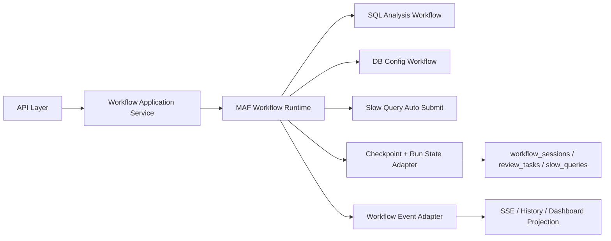

# MAF Workflow Architecture

## 决策结论

`DbOptimizer` 后续所有 workflow 能力以 Microsoft Agent Framework Workflow 为统一编排内核，不再扩展现有自研 `WorkflowRunner` 作为主引擎。

原因：

1. MAF 原生提供 graph-based workflow、typed executors、request/response、checkpointing、resume、observability。
2. 当前代码最缺的正是统一的编排、暂停/恢复、HITL 与状态投影能力。
3. 继续扩展自研 runner 会让 review、resume、SSE、slow query 追踪继续分叉。

## 外部事实基线

截至 `2026-04-17`，官方资料显示：

- Microsoft Learn 已提供 workflow overview、checkpoints、request/response、HITL 等文档。
- NuGet `Microsoft.Agents.AI.Workflows` 最新公开版本为 `1.0.0-rc4`。

参考：

- [MAF Workflows Overview](https://learn.microsoft.com/en-us/agent-framework/user-guide/workflows/overview)
- [MAF Request and Response](https://learn.microsoft.com/en-us/agent-framework/user-guide/workflows/request-and-response)
- [MAF Checkpoints](https://learn.microsoft.com/en-us/agent-framework/user-guide/workflows/checkpoints)
- [NuGet: Microsoft.Agents.AI.Workflows](https://www.nuget.org/packages/Microsoft.Agents.AI.Workflows/)

## 目标架构



### 分层职责

- API Layer
  - 只处理 HTTP DTO、参数校验、错误包络。
- Workflow Application Service
  - 选择 workflow 类型。
  - 创建 session。
  - 启动、恢复、取消 workflow。
- MAF Workflow Runtime
  - 用 `WorkflowBuilder` 构图。
  - 用 typed `Executor<TIn, TOut>` 和 request/response 驱动执行。
- Projection Layer
  - 把 MAF 事件投影成现有 `workflow_sessions`、`review_tasks`、SSE 事件、history 明细。

## 目标核心类

| 类 | 职责 | 关键方法 |
|---|---|---|
| `MafWorkflowRuntimeOptions` | MAF 运行时配置 | 配置属性 |
| `IMafWorkflowRuntime` | 启动/恢复/取消 workflow | `StartSqlAnalysisAsync` `StartDbConfigOptimizationAsync` `ResumeAsync` `CancelAsync` |
| `MafWorkflowRuntime` | MAF 主运行入口 | `StartAsync` `ResumeAsync` `CancelAsync` `RunInternalAsync` |
| `IMafWorkflowFactory` | 按 workflow type 构建新 workflow 实例 | `BuildSqlAnalysisWorkflow` `BuildDbConfigWorkflow` |
| `IMafRunStateStore` | 保存 MAF run 与 checkpoint 引用 | `SaveAsync` `GetAsync` `DeleteAsync` |
| `IWorkflowProjectionWriter` | 把 MAF 事件写回会话、历史、SSE、review | `ApplyAsync` |

建议签名：

```csharp
public interface IMafWorkflowFactory
{
    Workflow BuildSqlAnalysisWorkflow();
    Workflow BuildDbConfigWorkflow();
}

public interface IMafWorkflowRuntime
{
    Task<WorkflowStartResponse> StartSqlAnalysisAsync(SqlAnalysisWorkflowCommand command, CancellationToken cancellationToken = default);
    Task<WorkflowStartResponse> StartDbConfigOptimizationAsync(DbConfigWorkflowCommand command, CancellationToken cancellationToken = default);
    Task<WorkflowResumeResponse> ResumeAsync(Guid sessionId, CancellationToken cancellationToken = default);
    Task<WorkflowCancelResponse> CancelAsync(Guid sessionId, CancellationToken cancellationToken = default);
}
```

## HITL 方案

本项目不再使用“自定义 while 等待 + 轮询 review 表”的旧方案，改为：

1. workflow 中的 review gate executor 生成 review request。
2. request 通过 MAF request/response 通道挂起当前 workflow。
3. API 提交审核后，系统将审核结果转换为 response message。
4. workflow 从原 gate 继续执行。

恢复关联最小集合：

- `sessionId`
- `taskId`
- `requestId`
- `runId`
- `checkpointRef`

## Checkpoint 方案

业务状态与 MAF 内部状态分层保存：

- `workflow_sessions.state`: 面向 API/UI 的可查询状态。
- `engine_*`: 面向 MAF resume 的运行态引用。

建议对 `workflow_sessions` 增加：

- `engine_type`
- `engine_run_id`
- `engine_checkpoint_ref`
- `engine_state`
- `result_type`
- `source_type`
- `source_ref_id`

`review_tasks` 必须新增以下持久化字段，不是可选项：

- `request_id`
- `engine_run_id`
- `engine_checkpoint_ref`

原因：

- review submit DTO 不需要把这些字段回传给前端
- 但后端必须能在重启后、跨进程场景下，从 `review_tasks` 中恢复 request correlation

## 风险与约束

1. MAF 当前仍处于 RC 阶段，必须锁定具体版本。
2. 不要把现有领域分析逻辑重写成 agent；能保留 deterministic executor 的地方全部保留。
3. SQL 与配置调优都必须走同一套 result envelope 与投影体系。
