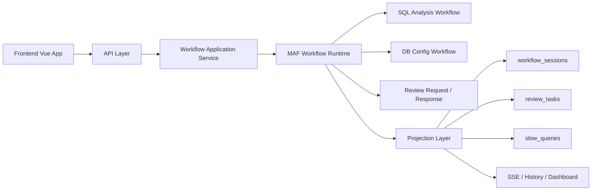

# System Architecture

## Purpose

定义 `DbOptimizer` 的标准架构视图，说明系统分层、关键模块、MAF 主线和依赖关系。

## Scope

覆盖：

1. 后端 API 与应用服务
2. MAF workflow runtime
3. review / history / replay / dashboard
4. 前端信息架构
5. 数据与持久化

## Current State

**✅ 已完成** (2026-04-18)

系统已完全迁移到 MAF，Legacy engine 已移除。

## Architecture State

### Architecture Summary

### Layers

| 层 | 责任 |
|---|---|
| Frontend | 展示 dashboard、workflow、review、history、slow query |
| API | 请求参数校验、DTO、错误包络 |
| Application | 启动/恢复/取消 workflow，编排业务入口 |
| MAF Runtime | 真正的 workflow 构图与执行 |
| Projection | 把 workflow 事件投影到业务表和 SSE |
| Persistence | 会话、review、slow query、prompt version |

## Architecture Rules

1. MAF 是唯一 workflow 引擎。
2. API 不直接暴露旧 `OptimizationReport`。
3. 所有 workflow 结果都走 `WorkflowResultEnvelope`。
4. Review 必须通过 request/response，而不是轮询。

## Key Modules

### Backend

- `DbOptimizer.API`
- `DbOptimizer.Infrastructure/Maf/*`
- `DbOptimizer.Infrastructure/Workflows/Application/*`
- `DbOptimizer.Infrastructure/Workflows/Projection/*`
- `DbOptimizer.Infrastructure/SlowQuery/*`

### Frontend

- `App.vue`
- `components/dashboard/*`
- `components/workflow/*`
- `components/review/*`
- `components/slow-query/*`

### Data

- `workflow_sessions`
- `review_tasks`
- `slow_queries`
- `prompt_versions`

## References

- [MAF_WORKFLOW_ARCHITECTURE.md](./MAF_WORKFLOW_ARCHITECTURE.md)
- [../03-design/SYSTEM_DESIGN_SPEC.md](../03-design/SYSTEM_DESIGN_SPEC.md)
