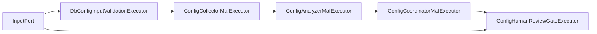

# DB Config Workflow Design

## 实施状态

**✅ 已实现** (2026-04-18)

基于 MAF 1.0.0-rc4 完整实现。

## Workflow 目标

对数据库实例配置做一条完整闭环：

1. 采集配置与指标
2. 规则分析
3. 汇总结果
4. 人工审核
5. 返回统一 `db-config-optimization-report`

## MAF 消息模型

新增文件：

`src/DbOptimizer.Infrastructure/Maf/DbConfig/DbConfigWorkflowMessages.cs`

```csharp
public sealed record DbConfigWorkflowCommand(
    Guid SessionId,
    string DatabaseId,
    string DatabaseType,
    bool AllowFallbackSnapshot,
    bool RequireHumanReview);

public sealed record ConfigSnapshotCollectedMessage(Guid SessionId, DbConfigSnapshotContract Snapshot);
public sealed record ConfigRecommendationsGeneratedMessage(Guid SessionId, DbConfigSnapshotContract Snapshot, IReadOnlyList<ConfigRecommendationContract> Recommendations);
public sealed record ConfigOptimizationDraftReadyMessage(Guid SessionId, WorkflowResultEnvelope DraftResult);
public sealed record DbConfigOptimizationCompletedMessage(Guid SessionId, WorkflowResultEnvelope FinalResult);
```

### 开关分支规则

1. `AllowFallbackSnapshot = true`
   - `ConfigCollectorMafExecutor` 采集失败时允许降级为 fallback snapshot
2. `AllowFallbackSnapshot = false`
   - 采集失败直接进入 failed
3. `RequireHumanReview = true`
   - `ConfigHumanReviewGateExecutor` 创建 `review_tasks` 并挂起 workflow
4. `RequireHumanReview = false`
   - `ConfigHumanReviewGateExecutor` 不创建 `review_tasks`
   - 直接输出 `DbConfigOptimizationCompletedMessage`

## Executor 列表

### `DbConfigInputValidationExecutor`

```csharp
internal sealed class DbConfigInputValidationExecutor()
    : Executor<DbConfigWorkflowCommand, DbConfigWorkflowCommand>("DbConfigInputValidationExecutor")
{
    public override ValueTask<DbConfigWorkflowCommand> HandleAsync(
        DbConfigWorkflowCommand message,
        IWorkflowContext context,
        CancellationToken cancellationToken = default);
}
```

### `ConfigCollectorMafExecutor`

```csharp
internal sealed class ConfigCollectorMafExecutor(IConfigCollectionProvider collectionProvider)
    : Executor<DbConfigWorkflowCommand, ConfigSnapshotCollectedMessage>("ConfigCollectorMafExecutor")
{
    public override ValueTask<ConfigSnapshotCollectedMessage> HandleAsync(
        DbConfigWorkflowCommand message,
        IWorkflowContext context,
        CancellationToken cancellationToken = default);
}
```

### `ConfigAnalyzerMafExecutor`

```csharp
internal sealed class ConfigAnalyzerMafExecutor(IConfigRuleEngine configRuleEngine)
    : Executor<ConfigSnapshotCollectedMessage, ConfigRecommendationsGeneratedMessage>("ConfigAnalyzerMafExecutor")
{
    public override ValueTask<ConfigRecommendationsGeneratedMessage> HandleAsync(
        ConfigSnapshotCollectedMessage message,
        IWorkflowContext context,
        CancellationToken cancellationToken = default);
}
```

### `ConfigCoordinatorMafExecutor`

```csharp
internal sealed class ConfigCoordinatorMafExecutor(IWorkflowResultSerializer resultSerializer)
    : Executor<ConfigRecommendationsGeneratedMessage, ConfigOptimizationDraftReadyMessage>("ConfigCoordinatorMafExecutor")
{
    public override ValueTask<ConfigOptimizationDraftReadyMessage> HandleAsync(
        ConfigRecommendationsGeneratedMessage message,
        IWorkflowContext context,
        CancellationToken cancellationToken = default);
}
```

### `ConfigHumanReviewGateExecutor`

```csharp
internal sealed class ConfigHumanReviewGateExecutor(
    IWorkflowReviewTaskGateway reviewTaskGateway,
    IConfigReviewAdjustmentService adjustmentService)
    : ReflectingExecutor<ConfigHumanReviewGateExecutor>("ConfigHumanReviewGateExecutor"),
      IMessageHandler<ConfigOptimizationDraftReadyMessage>,
      IMessageHandler<ReviewDecisionResponseMessage>
{
    public ValueTask HandleAsync(ConfigOptimizationDraftReadyMessage message, IWorkflowContext context);

    public ValueTask<DbConfigOptimizationCompletedMessage> HandleAsync(
        ReviewDecisionResponseMessage message,
        IWorkflowContext context);
}
```

行为：

- `RequireHumanReview = true`
  - 创建 review task
  - 发送 request 并挂起 workflow
- `RequireHumanReview = false`
  - 直接把 `DraftResult` 转换为 completed message

## Workflow 图



说明：

- `F` 为条件 gate
- 当 `RequireHumanReview = false` 时，不经过人工审核队列

## 关键服务

### `IConfigReviewAdjustmentService`

```csharp
public interface IConfigReviewAdjustmentService
{
    WorkflowResultEnvelope ApplyAdjustments(
        WorkflowResultEnvelope draft,
        IReadOnlyDictionary<string, JsonElement> adjustments);
}
```

## 前端展示要求

配置调优必须有独立入口：

- 导航增加 `db-config`
- 提交表单至少包含 `databaseId`、`databaseType`
- 结果页按 `db-config-optimization-report` 渲染

## 验收重点

1. 配置调优能从前端发起。
2. `GET /api/workflows/{sessionId}`、`GET /api/history/{sessionId}`、`GET /api/reviews/{taskId}` 都能返回配置调优结果。
3. review submit 后 workflow 能完成。
