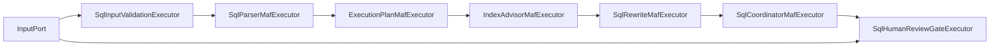

# SQL Analysis Workflow Design

## 实施状态

**✅ 已实现** (2026-04-18)

基于 MAF 1.0.0-rc4 完整实现。

## Workflow 目标

输入一条 SQL 与数据库上下文，输出：

- 解析结果
- 执行计划诊断
- 索引建议
- SQL rewrite 建议
- 统一 `WorkflowResultEnvelope`
- 人工审核后的最终报告

## MAF 消息模型

新增文件：

`src/DbOptimizer.Infrastructure/Maf/SqlAnalysis/SqlAnalysisWorkflowMessages.cs`

```csharp
public sealed record SqlAnalysisWorkflowCommand(
    Guid SessionId,
    string SqlText,
    string DatabaseId,
    string DatabaseEngine,
    string SourceType,
    Guid? SourceRefId,
    bool EnableIndexRecommendation,
    bool EnableSqlRewrite,
    bool RequireHumanReview);

public sealed record SqlParsingCompletedMessage(Guid SessionId, ParsedSqlContract ParsedSql);
public sealed record ExecutionPlanCompletedMessage(Guid SessionId, ParsedSqlContract ParsedSql, ExecutionPlanContract ExecutionPlan);
public sealed record IndexRecommendationCompletedMessage(Guid SessionId, ParsedSqlContract ParsedSql, ExecutionPlanContract ExecutionPlan, IReadOnlyList<IndexRecommendationContract> IndexRecommendations);
public sealed record SqlRewriteCompletedMessage(Guid SessionId, ParsedSqlContract ParsedSql, ExecutionPlanContract ExecutionPlan, IReadOnlyList<IndexRecommendationContract> IndexRecommendations, IReadOnlyList<SqlRewriteSuggestionContract> SqlRewriteSuggestions);
public sealed record SqlOptimizationDraftReadyMessage(Guid SessionId, WorkflowResultEnvelope DraftResult);
public sealed record ReviewDecisionResponseMessage(Guid SessionId, Guid TaskId, string RequestId, string RunId, string CheckpointRef, string Action, string? Comment, IReadOnlyDictionary<string, JsonElement> Adjustments, DateTimeOffset ReviewedAt);
public sealed record SqlOptimizationCompletedMessage(Guid SessionId, WorkflowResultEnvelope FinalResult);
```

### 开关分支规则

为避免因为 option 开关导致消息流断裂，SQL workflow 的门控规则固定如下：

1. `EnableIndexRecommendation = true`
   - `IndexAdvisorMafExecutor` 调用真实索引推荐逻辑
2. `EnableIndexRecommendation = false`
   - `IndexAdvisorMafExecutor` 不调用推荐生成器
   - 输出 `IndexRecommendationCompletedMessage`，其中 `IndexRecommendations = []`
3. `EnableSqlRewrite = true`
   - `SqlRewriteMafExecutor` 调用真实 rewrite 逻辑
4. `EnableSqlRewrite = false`
   - `SqlRewriteMafExecutor` 直接输出 `SqlRewriteCompletedMessage`
   - 其中 `SqlRewriteSuggestions = []`

换句话说：

- `IndexAdvisorMafExecutor` 和 `SqlRewriteMafExecutor` 都是“门控 + 执行”节点
- 不采用“把节点从 graph 中删除”的实现方式
- 后续节点永远消费固定消息类型，不根据 option 改消息形状

## Executor 列表

### `SqlInputValidationExecutor`

```csharp
internal sealed class SqlInputValidationExecutor()
    : Executor<SqlAnalysisWorkflowCommand, SqlAnalysisWorkflowCommand>("SqlInputValidationExecutor")
{
    public override ValueTask<SqlAnalysisWorkflowCommand> HandleAsync(
        SqlAnalysisWorkflowCommand message,
        IWorkflowContext context,
        CancellationToken cancellationToken = default);
}
```

### `SqlParserMafExecutor`

```csharp
internal sealed class SqlParserMafExecutor(ISqlParser parser)
    : Executor<SqlAnalysisWorkflowCommand, SqlParsingCompletedMessage>("SqlParserMafExecutor")
{
    public override ValueTask<SqlParsingCompletedMessage> HandleAsync(
        SqlAnalysisWorkflowCommand message,
        IWorkflowContext context,
        CancellationToken cancellationToken = default);
}
```

### `ExecutionPlanMafExecutor`

```csharp
internal sealed class ExecutionPlanMafExecutor(
    IExecutionPlanProvider executionPlanProvider,
    IExecutionPlanAnalyzer executionPlanAnalyzer)
    : Executor<SqlParsingCompletedMessage, ExecutionPlanCompletedMessage>("ExecutionPlanMafExecutor")
{
    public override ValueTask<ExecutionPlanCompletedMessage> HandleAsync(
        SqlParsingCompletedMessage message,
        IWorkflowContext context,
        CancellationToken cancellationToken = default);
}
```

### `IndexAdvisorMafExecutor`

```csharp
internal sealed class IndexAdvisorMafExecutor(
    ITableIndexMetadataProvider metadataProvider,
    IIndexRecommendationGenerator recommendationGenerator)
    : Executor<ExecutionPlanCompletedMessage, IndexRecommendationCompletedMessage>("IndexAdvisorMafExecutor")
{
    public override ValueTask<IndexRecommendationCompletedMessage> HandleAsync(
        ExecutionPlanCompletedMessage message,
        IWorkflowContext context,
        CancellationToken cancellationToken = default);
}
```

### `SqlRewriteMafExecutor`

```csharp
internal sealed class SqlRewriteMafExecutor(ISqlRewriteAdvisor sqlRewriteAdvisor)
    : Executor<IndexRecommendationCompletedMessage, SqlRewriteCompletedMessage>("SqlRewriteMafExecutor")
{
    public override ValueTask<SqlRewriteCompletedMessage> HandleAsync(
        IndexRecommendationCompletedMessage message,
        IWorkflowContext context,
        CancellationToken cancellationToken = default);
}
```

### `SqlCoordinatorMafExecutor`

```csharp
internal sealed class SqlCoordinatorMafExecutor(IWorkflowResultSerializer resultSerializer)
    : Executor<SqlRewriteCompletedMessage, SqlOptimizationDraftReadyMessage>("SqlCoordinatorMafExecutor")
{
    public override ValueTask<SqlOptimizationDraftReadyMessage> HandleAsync(
        SqlRewriteCompletedMessage message,
        IWorkflowContext context,
        CancellationToken cancellationToken = default);
}
```

### `SqlHumanReviewGateExecutor`

```csharp
internal sealed class SqlHumanReviewGateExecutor(
    IWorkflowReviewTaskGateway reviewTaskGateway,
    ISqlReviewAdjustmentService adjustmentService)
    : ReflectingExecutor<SqlHumanReviewGateExecutor>("SqlHumanReviewGateExecutor"),
      IMessageHandler<SqlOptimizationDraftReadyMessage>,
      IMessageHandler<ReviewDecisionResponseMessage>
{
    public ValueTask HandleAsync(SqlOptimizationDraftReadyMessage message, IWorkflowContext context);

    public ValueTask<SqlOptimizationCompletedMessage> HandleAsync(
        ReviewDecisionResponseMessage message,
        IWorkflowContext context);
}
```

行为：

- 收到 draft 时：创建 `review_tasks`，通过 MAF request/response 发送 review request，workflow 暂停
- 收到 response 时：
  - `approve` -> 直接生成最终结果
  - `adjust` -> 应用调整后生成最终结果
  - `reject` -> 标记 failed

request/response 关联规则：

- `RequestId` 由 review gate 创建
- `RunId` 与 `CheckpointRef` 来自当前 `MafCheckpointEnvelope`
- review submit 时，必须按 `TaskId + RequestId + RunId + CheckpointRef` 组装 response

`RequireHumanReview` 规则：

- `RequireHumanReview = true`
  - `SqlHumanReviewGateExecutor` 创建 `review_tasks`
  - 发送 review request 并挂起 workflow
- `RequireHumanReview = false`
  - `SqlHumanReviewGateExecutor` 不创建 `review_tasks`
  - 直接将 `DraftResult` 转换为 `SqlOptimizationCompletedMessage`
  - workflow 立即进入 completed

## Workflow 图



说明：

- 图结构固定不变
- `H` 是条件 gate，不代表一定进入人工审核
- 当 `RequireHumanReview = false` 时，`H` 直接输出 completed message

## 关键服务

### `ISqlRewriteAdvisor`

```csharp
public interface ISqlRewriteAdvisor
{
    Task<IReadOnlyList<SqlRewriteSuggestionContract>> GenerateAsync(
        ParsedSqlContract parsedSql,
        ExecutionPlanContract executionPlan,
        CancellationToken cancellationToken = default);
}
```

`SqlRewriteCompletedMessage` 是 SQL rewrite 的唯一承载消息；后续节点不得再从 `Metadata` 中猜取 rewrite 建议。

### `ISqlReviewAdjustmentService`

```csharp
public interface ISqlReviewAdjustmentService
{
    WorkflowResultEnvelope ApplyAdjustments(
        WorkflowResultEnvelope draft,
        IReadOnlyDictionary<string, JsonElement> adjustments);
}
```

## 验收重点

1. SQL workflow 必须通过 MAF 执行。
2. 结果必须返回 `sql-optimization-report`。
3. review submit 后 workflow 必须继续，而不是后台轮询。
