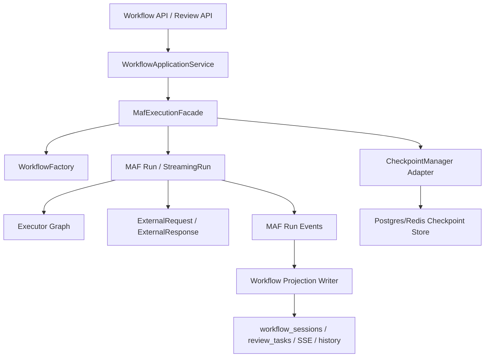

# MAF Native Runtime Refactor Plan

## 0. Implementation Status

- 2026-04-20: `PR-0` baseline landed in code.
  - Upgraded `Microsoft.Agents.AI.Workflows` from `1.0.0-rc4` to `1.1.0`.
  - Aligned the `Microsoft.Extensions.*` package versions required by the new MAF dependency graph.
  - Verified the upgraded baseline still builds in `DbOptimizer.Infrastructure` and `DbOptimizer.API`.
- 2026-04-20: `PR-1` guard tests landed in `DbOptimizer.Infrastructure.Tests`.
  - Added a minimal native MAF interop test that verifies `ExternalRequest -> PendingRequests -> ResumeStreamingAsync -> Ended`.
  - Fixed existing test-project compile drift caused by MAF API changes such as `DescribeProtocolAsync` returning `ValueTask` and the `MafWorkflowRuntime` constructor signature change.
  - The minimal interop tests pass on top of MAF `1.1.0`.
  - Scope note: `PR-0` / `PR-1` only prove native MAF interop at the isolated test level; they do not mean the production starter/runtime/review API path has already switched to native checkpoint/request-response/resume semantics.

## 1. 文档目的

这份文档用于回答两个问题：

1. 当前 `DbOptimizer` 的 workflow 实现，哪些部分是 MAF 原生能力，哪些部分是项目自定义外壳。
2. 如果要收敛到更原生的 MAF 写法，应该按什么顺序重构，哪些文件要动，怎么验收，怎么回滚。

本文不是泛泛而谈的架构说明，而是针对当前仓库代码的纠偏方案。

---

## 2. 当前实现的真实状态

## 2.1 已经在使用 MAF 的部分

当前代码并不是“没有用 MAF”，而是已经使用了 MAF 的两项核心能力：

1. 使用 `WorkflowBuilder` 构建 workflow graph。
2. 使用 `Executor<TInput, TOutput>` 和 `InProcessExecution.RunAsync(...)` 执行 graph。

对应代码位置：

- `src/DbOptimizer.Infrastructure/Maf/Runtime/MafWorkflowFactory.cs`
- `src/DbOptimizer.Infrastructure/Maf/Runtime/MafSqlWorkflowStarter.cs`
- `src/DbOptimizer.Infrastructure/Maf/Runtime/MafConfigWorkflowStarter.cs`
- `src/DbOptimizer.Infrastructure/Maf/SqlAnalysis/Executors/*`
- `src/DbOptimizer.Infrastructure/Maf/DbConfig/Executors/*`

## 2.2 不够原生、偏自研的部分

当前最主要的问题不是“是否使用了 MAF”，而是 workflow 生命周期没有真正交给 MAF 托管。

目前存在以下偏差：

1. 启动、恢复、取消由 `MafWorkflowRuntime` 自己管理，而不是围绕 MAF `Run` / `StreamingRun` 做统一 orchestration。
2. SQL / Config workflow 的启动器通过 `Task.Run` fire-and-forget 在后台执行，这让运行态和 HTTP 请求解耦，但也绕开了 MAF 原生的 run 生命周期管理。
3. Human-in-the-loop 通过抛 `WorkflowSuspendedException` 实现，而不是通过 MAF 的 `ExternalRequest` / `ExternalResponse` 机制实现真正的“挂起并等待外部输入”。
4. Resume 逻辑并没有基于 MAF checkpoint 做真正恢复，当前代码里仍然保留 `TODO` 和“直接把 session 标为 completed”的临时实现。
5. Checkpoint 体系有两套概念混在一起：
   - 一套是业务 `workflow_sessions.state`
   - 一套是自定义 `IMafRunStateStore` / `IMafCheckpointStore`
   但还没有真正把它们收敛到 MAF `CheckpointManager` 的正式用法上。
6. 事件、日志、投影虽然围绕 workflow 做了很多扩展，但大多是“围绕自研 runtime”补的，不是直接消费 MAF run 事件流。

## 2.3 结论

当前实现应当被准确描述为：

`MAF graph/executor engine + 自研 runtime/starter/session/checkpoint 外壳`

这不是纯 MAF 原生写法。

---

## 3. 目标状态

目标不是把业务层全部删除，而是把职责重新收敛：

1. MAF 负责 graph 执行、checkpoint、pending request、resume。
2. 应用层只负责：
   - 参数校验
   - 选择 workflow 类型
   - 持久化业务快照
   - 暴露 API / SSE / history / review
3. 基础设施层只保留对 MAF 的“适配层”，不再重复发明 workflow runtime 语义。

目标形态如下：



---

## 4. 当前实现与目标实现的差异表

| 维度 | 当前实现 | 目标实现 |
|---|---|---|
| Workflow graph | MAF `WorkflowBuilder` | 保持不变 |
| Executor | MAF `Executor<TIn,TOut>` | 保持不变 |
| 启动 | `Task.Run` + starter 手工调度 | `InProcessExecution.RunAsync/RunStreamingAsync` 统一入口 |
| 挂起 | 抛 `WorkflowSuspendedException` | `ExternalRequest` 导致 `RunStatus.PendingRequests` |
| 恢复 | 自定义 `ResumeAsync`，未真正恢复 checkpoint | `InProcessExecution.ResumeAsync(...)` + `Run.ResumeAsync(responses)` |
| Checkpoint | 自定义 `RunStateStore + CheckpointStore` | `CheckpointManager` 为中心，自定义存储仅作为适配器 |
| Review | 自建 review correlation，挂起语义不原生 | review task 仍保留，但以 MAF request/response 为中心 |
| 事件 | 业务层补发 `WorkflowEventMessage` | 优先消费 MAF run 事件，业务事件作为投影层输出 |
| 日志 | runtime/starter/provider 手工打点 | 统一 run/superstep/executor/request 日志，基于 MAF run 生命周期 |

---

## 5. 设计原则

## 5.1 保留的东西

以下资产不应推倒重来：

1. 已有 typed executors。
2. 已有 workflow message contracts。
3. 现有 API 契约。
4. `workflow_sessions`、`review_tasks`、history、SSE、projection 这些业务投影表和接口。
5. 已有 provider 级别能力，例如 MCP 调用、执行计划采集、配置采集、索引分析。

## 5.2 必须替换的东西

以下能力必须逐步收敛到 MAF 原生语义：

1. 手工 `Task.Run` 启动模式。
2. 以异常代表 workflow 挂起的模式。
3. 未完成的 resume 流程。
4. “session 状态流转”与“MAF run 状态”分裂的做法。

## 5.3 明确不做的事

本次重构不做以下内容：

1. 不改前端展示模型。
2. 不改 SQL / Config 业务算法。
3. 不删除 fallback 基础设施类型，只在运行路径中不使用。
4. 不引入第二套 workflow 引擎。

---

## 6. 目标技术方案

## 6.1 统一执行入口

引入一个更薄的执行门面，例如 `MafExecutionFacade`，职责只有三类：

1. 启动 workflow
2. 从 checkpoint 恢复 workflow
3. 把外部响应送回 pending request

它不再自己管理业务状态机，只围绕以下 MAF API 工作：

- `InProcessExecution.RunAsync(...)`
- `InProcessExecution.RunStreamingAsync(...)`
- `InProcessExecution.ResumeAsync(...)`
- `Run.ResumeAsync(IEnumerable<ExternalResponse>, ...)`
- `Run.GetStatusAsync(...)`

建议保留 `IMafWorkflowRuntime` 接口，但内部实现改为“MAF façade”，而不是“自定义 workflow runtime”。

## 6.2 统一 checkpoint 方案

当前仓库已经有 `workflow_sessions.state`、`ICheckpointStorage`、`IMafCheckpointStore`、`MafRunStateStore` 多套概念。

目标结构应当是：

1. `CheckpointManager` 成为唯一正式 checkpoint 入口。
2. 项目自定义存储只实现 MAF 需要的 store/manager 适配，不再自己定义新的 checkpoint 生命周期。
3. `workflow_sessions.state` 只保存业务快照，不保存 MAF 内部执行语义。

建议做法：

1. 以 `CheckpointManager.CreateJson(...)` 为主入口。
2. 用现有 PostgreSQL/Redis 作为 `JsonCheckpointStore` 或等价适配实现。
3. `workflow_sessions` 中保留：
   - `engine_run_id`
   - `engine_checkpoint_ref`
   - `state`（业务快照）
4. `IMafRunStateStore` 降级为“运行态索引/关联适配器”，而不是 resume 真相来源。

## 6.3 Human-in-the-loop 改为 request/response

这是整个方案里最关键的一步。

当前做法：

1. `SqlHumanReviewGateExecutor` 创建 review task。
2. 抛 `WorkflowSuspendedException`。
3. 外层捕获异常，把 session 改成 `suspended`。
4. review submit 后，外层手工补状态。

目标做法：

1. review gate executor 创建 `ExternalRequest`。
2. workflow 进入 `RunStatus.PendingRequests`。
3. MAF 生成 `CheckpointInfo`。
4. 系统把 `requestId/taskId/checkpointInfo` 持久化到 `review_tasks`。
5. 用户提交审核后，系统构造 `ExternalResponse`。
6. 调用 `Run.ResumeAsync(...)` 或恢复后的 run 继续执行。

业务上仍然可以保留 `review_tasks` 表，但它变成“MAF request 的业务映射表”，而不是挂起机制本身。

## 6.4 统一事件与日志

重构后事件应分为两层：

1. 引擎层事件
   - `RequestInfoEvent`
   - `ExecutorCompletedEvent`
   - `SuperStepCompletedEvent`
   - run status
2. 业务层事件
   - `WorkflowStarted`
   - `ExecutorStarted`
   - `ExecutorCompleted`
   - `WorkflowWaitingReview`
   - `WorkflowCompleted`
   - `WorkflowFailed`

原则是：

1. 业务层事件继续保留，前端不需要改协议。
2. 业务层事件的来源改为“MAF 事件投影”，而不是 starter/runtime 人工硬编码。
3. 日志中应显式打出：
   - run id
   - session id
   - superstep 编号
   - activated executors
   - pending requests 数量
   - checkpoint id
   - external request id

---

## 7. 分阶段重构方案

## 阶段 0：基线冻结

目标：

在正式重构前，先把“现状是什么”固定下来，防止边改边漂移。

任务：

1. 为当前 SQL workflow 和 Config workflow 录制一组基线日志。
2. 为启动、挂起、审核、恢复、失败各场景补最小集成测试。
3. 标记当前不正确但仍存在的行为：
   - `ResumeAsync` 非真正恢复
   - `WorkflowSuspendedException` 不是 MAF request
   - `Task.Run` 背景执行

产出：

1. 基线测试样例。
2. 基线日志样例。
3. 一份“已知偏差列表”。

验收：

1. 至少能稳定复现一次 SQL workflow 从 start 到 waiting review。
2. 至少能稳定复现一次 review submit 后的当前行为。

## 阶段 1：CheckpointManager 收口

目标：

把 checkpoint 真相源从“自定义 runtime 约定”收口为“MAF CheckpointManager”。

任务：

1. 新建 MAF checkpoint manager 适配层。
2. 用现有 PostgreSQL/Redis 存储实现 MAF 所需持久化接口。
3. 在 workflow 启动时启用带 checkpoint 的执行环境：
   - `InProcessExecution.RunAsync(workflow, input, checkpointManager, sessionId, ct)`
4. 将 `engine_checkpoint_ref` 写入 `CheckpointInfo.CheckpointId` 对应值。
5. `workflow_sessions.state` 与引擎 checkpoint 明确分离。

影响文件：

- `src/DbOptimizer.Infrastructure/Checkpointing/*`
- `src/DbOptimizer.Infrastructure/Maf/Runtime/IMafCheckpointStore.cs`
- `src/DbOptimizer.Infrastructure/Maf/Runtime/MafCheckpointStore.cs`
- `src/DbOptimizer.Infrastructure/Maf/Runtime/MafWorkflowRuntime.cs`

退出标准：

1. workflow 每个 superstep 后都能拿到 `CheckpointInfo`。
2. 不再依赖“手工保存一个 runId + checkpointRef 的影子状态”才知道怎么恢复。

## 阶段 2：去掉 starter 型 fire-and-forget 外壳

目标：

移除 `MafSqlWorkflowStarter` / `MafConfigWorkflowStarter` 作为 workflow 生命周期中心的角色。

任务：

1. 将 starter 的职责下沉为小型辅助函数：
   - 创建 session
   - 写业务快照
   - 启动日志
2. 移除核心执行路径中的 `Task.Run`。
3. 让 `MafWorkflowRuntime` 或新 façade 直接返回 MAF `Run` / `StreamingRun` 的结果。
4. 将“完成/失败/等待审核”的判定改为从 `RunStatus` 和 MAF 事件流得出。

影响文件：

- `src/DbOptimizer.Infrastructure/Maf/Runtime/MafSqlWorkflowStarter.cs`
- `src/DbOptimizer.Infrastructure/Maf/Runtime/MafConfigWorkflowStarter.cs`
- `src/DbOptimizer.Infrastructure/Maf/Runtime/MafWorkflowRuntime.cs`

退出标准：

1. 启动 workflow 不再依赖 fire-and-forget 后台任务。
2. 业务状态流转能直接映射到 MAF run 状态。

## 阶段 3：把 review gate 改为 ExternalRequest/ExternalResponse

目标：

把最不原生的挂起/恢复模型替换成 MAF 正式 request/response。

任务：

1. 重写 `SqlHumanReviewGateExecutor`：
   - 不再抛 `WorkflowSuspendedException`
   - 改为创建 `ExternalRequest`
2. 重写 `ConfigHumanReviewGateExecutor` 同步做法。
3. review API 保存：
   - `requestId`
   - `sessionId`
   - `checkpointInfo`
   - `taskId`
4. review submit 时构造 `ExternalResponse`。
5. 通过 `Run.ResumeAsync(...)` 继续执行原 workflow，而不是手工标状态。

影响文件：

- `src/DbOptimizer.Infrastructure/Maf/SqlAnalysis/Executors/SqlHumanReviewGateExecutor.cs`
- `src/DbOptimizer.Infrastructure/Maf/DbConfig/Executors/ConfigHumanReviewGateExecutor.cs`
- `src/DbOptimizer.Infrastructure/Workflows/Review/*`
- `src/DbOptimizer.API/Api/ReviewApi.cs`

退出标准：

1. workflow 挂起后，状态表现为 `PendingRequests`。
2. review submit 后，workflow 从 checkpoint 正常继续，而不是“重建一个新流程”或“直接改 completed”。

## 阶段 4：统一事件投影

目标：

让前端 timeline / history / SSE 主要消费“MAF run 投影后的业务事件”，而不是 starter 手工补事件。

任务：

1. 建立 MAF run event 到 `WorkflowEventMessage` 的正式映射。
2. 利用：
   - `RequestInfoEvent`
   - `SuperStepCompletedEvent`
   - `ExecutorCompletedEvent`
   - `RunStatus`
3. 让 `WorkflowProjectionWriter` 只消费统一事件源。
4. 逐步减少 starter/runtime 中的人工事件发布代码。

影响文件：

- `src/DbOptimizer.Infrastructure/Workflows/Events/*`
- `src/DbOptimizer.Infrastructure/Workflows/Projection/*`
- `src/DbOptimizer.Infrastructure/Maf/Runtime/MafExecutorInstrumentation.cs`

退出标准：

1. 前端事件协议不变。
2. 事件来源从“自定义 runtime 硬编码”迁移为“MAF 事件投影”。

## 阶段 5：统一日志与可观测性

目标：

日志从“当前节点开始/结束”升级到“MAF run 可诊断日志”。

任务：

1. 给每个 run 打统一相关字段：
   - `SessionId`
   - `RunId`
   - `WorkflowType`
   - `CheckpointId`
   - `RequestId`
   - `SuperStep`
2. 记录每次 superstep：
   - activated executors
   - has pending messages
   - has pending requests
   - checkpoint id
3. 记录每次 external request/response：
   - request payload type
   - request id
   - task id
   - response action
4. 保留当前 provider 级日志，用于定位 MCP 卡点。

退出标准：

1. 后端日志能回答“卡在哪个 executor / 哪个 superstep / 哪个 request / 哪个 checkpoint”。
2. 不再只有 `session stuck` 但看不到引擎内部状态的情况。

## 阶段 6：删掉临时路径

目标：

在新路径稳定后，删除旧的自研 runtime 行为，避免以后回退到旧模式。

任务：

1. 删除 resume 中的 `TODO` 临时实现。
2. 删除“审核后直接把 session 标 completed”的兜底逻辑。
3. 删除 `WorkflowSuspendedException` 驱动的挂起路径。
4. 删除依赖 starter 手工判定 `RunStatus` 的旧分支。

退出标准：

1. 整条 workflow 生命周期只有一套语义。
2. 文档与代码一致。

---

## 8. 推荐 PR 拆分

建议拆成 5 个 PR，而不是一次性大改。

### PR-1：CheckpointManager 接入

范围：

1. 接入 MAF checkpoint manager。
2. 让 SQL / Config workflow 启动时都走 checkpoint-enabled execution。
3. 不改 review gate 语义。

验收：

1. 能拿到 checkpoint id。
2. 原行为不回退。

### PR-2：Runtime 收口

范围：

1. 移除 `Task.Run` 主路径。
2. starter 降级为辅助层。
3. `MafWorkflowRuntime` 改为真正的执行门面。

验收：

1. start/cancel/status 路径仍然可用。
2. 不再依赖后台 fire-and-forget。

### PR-3：Review Gate MAF 化

范围：

1. SQL review gate 改成 `ExternalRequest/ExternalResponse`。
2. Config review gate 同步改造。

验收：

1. workflow 在审核点进入 `PendingRequests`。
2. 审核后真实恢复执行。

### PR-4：事件和日志统一

范围：

1. run event 投影。
2. superstep/request/checkpoint 日志。
3. 前端协议保持不变。

验收：

1. 时间线完整。
2. 日志可定位卡点。

### PR-5：删除旧路径

范围：

1. 删除 `WorkflowSuspendedException` 路径。
2. 删除 resume 临时实现。
3. 删除不再使用的旧 runtime 分支。

验收：

1. 代码中不再存在“伪恢复”逻辑。
2. 文档同步更新。

---

## 9. 风险与应对

## 9.1 最大风险

最大风险不是 graph 执行，而是 Human-in-the-loop 的迁移。

原因：

1. 当前 review 体系已经和业务表、前端流程、history/replay 绑定。
2. 一旦 request/response 映射做错，会出现：
   - review task 建了但 workflow 没挂起
   - workflow 挂起了但 requestId 没保存
   - review submit 后恢复错 checkpoint

应对：

1. SQL workflow 先改。
2. Config workflow 后改。
3. 先保留旧 review table，不先动表结构大改。

## 9.2 中等风险

Checkpoint 适配层一旦设计不稳，后面 resume 会持续返工。

应对：

1. 先打通 `CheckpointManager -> store -> CheckpointInfo -> ResumeAsync` 最小闭环。
2. 不要同时改 review gate 和 checkpoint store。

## 9.3 低风险

前端兼容风险较低，因为业务事件协议可以保持不变。

---

## 10. 测试与验收标准

每个阶段至少验证以下场景。

## 10.1 SQL workflow

1. start -> completed
2. start -> waiting review
3. waiting review -> approve -> completed
4. waiting review -> reject -> failed
5. provider/MCP error -> failed

## 10.2 Config workflow

1. start -> completed
2. start -> waiting review
3. waiting review -> approve -> completed
4. waiting review -> reject -> failed
5. MCP unavailable -> failed

## 10.3 恢复能力

1. checkpoint 存在时可恢复。
2. checkpoint 丢失时明确报错。
3. requestId 不匹配时明确报错。

## 10.4 日志能力

日志必须能回答以下问题：

1. 当前卡在哪个 executor。
2. 当前停在第几个 superstep。
3. 是否存在 pending request。
4. 当前 checkpoint id 是什么。
5. 审核恢复对应的是哪个 requestId。

---

## 11. 建议先做的最小闭环

如果只选一条最值得先做的链路，建议优先做：

1. SQL workflow
2. review gate
3. checkpoint/resume 真恢复

原因：

1. SQL workflow 是用户最常用、最容易感知“卡死”的路径。
2. 它同时覆盖 MAF 原生化最难的两点：
   - request/response
   - checkpoint/resume
3. 这条链打通后，Config workflow 基本可以按同样模式复制。

---

## 12. 最终结论

当前代码已经在“使用 MAF”，但还没有“按 MAF 的方式管理 workflow 生命周期”。

要真正变成更原生的 MAF 写法，不是重写 executors，也不是重写前端，而是完成以下三件事：

1. 用 `CheckpointManager + ResumeAsync` 接管恢复语义。
2. 用 `ExternalRequest/ExternalResponse` 接管人工审核语义。
3. 用 MAF run event 接管状态、日志和投影语义。

只要这三件事落地，当前实现就会从：

`MAF engine + 自研 runtime 外壳`

收敛为：

`业务应用层 + MAF 原生执行内核 + 轻量投影适配层`

这才是本项目应当追求的最终形态。

---

## 13. 补充决策：性能影响与异步执行策略

这一项需要明确，否则阶段 2 很容易误改成“同步阻塞型 API”。

### 13.1 当前与目标的正确对比

当前：

1. `POST /api/workflows/...` 创建 session 后快速返回。
2. 真正执行依赖 `Task.Run` fire-and-forget。
3. 前端通过 SSE / 查询接口观察进度。

目标：

1. 保留“快速返回 + 异步观察”的 API 语义。
2. 去掉无约束的 `Task.Run` 裸后台执行。
3. 改用 MAF 原生的 `RunAsync(...)` / `RunStreamingAsync(...)` / `ResumeAsync(...)` 受管执行模型。

### 13.2 结论

本方案不建议把 workflow API 改成：

1. 同步等待完整 workflow 结束
2. 让 HTTP 请求生命周期承载完整执行过程

原因：

1. 会直接拉高 API 响应时间。
2. 长时间运行的 workflow 更容易触发代理层和客户端超时。
3. 这不符合当前前端和业务交互模型。

### 13.3 推荐策略

建议采用：

`异步业务语义保留，异步执行机制改为 MAF 原生受管模型`

落地规则：

1. `POST /api/workflows/...` 仍然只负责“接收任务并成功创建 run”。
2. 接口返回条件是“run 已进入受管状态”，不是“workflow 已完成”。
3. 实时进度继续通过 SSE 暴露。
4. 服务端内部优先使用 `RunStreamingAsync(...)` 或等价受管运行模式消费 MAF 事件。
5. 不再依赖裸 `Task.Run`。

### 13.4 阶段 2 的修正说明

原方案中“移除核心执行路径中的 `Task.Run`”这句话，必须补上下面这条解释：

1. 移除的是“裸 fire-and-forget 实现”。
2. 不是把 API 改成同步阻塞到 workflow 完成为止。
3. 如果需要后台持续执行，必须基于 MAF run/streaming run 或明确的受管 worker 模式，而不是任意线程池任务。

### 13.5 API 响应模式的具体实现

推荐模式：

`启动后立即返回`

接口约束：

1. API 只负责校验、创建 session、启动受管执行。
2. API 不等待 workflow 完成。
3. 前端继续通过 SSE 或轮询获取进度。

建议的实现形态如下：

```csharp
[HttpPost("workflows/sql")]
public async Task<IActionResult> StartSqlWorkflow(
    [FromBody] SqlWorkflowRequest request,
    CancellationToken ct)
{
    var sessionId = Guid.NewGuid();

    await _sessionRepo.CreateAsync(sessionId, request, ct);
    await _workflowDispatchService.EnqueueAsync(sessionId, request, ct);

    return Accepted(new
    {
        sessionId,
        status = "running"
    });
}
```

这里故意不再使用：

1. 裸 `Task.Run`
2. 裸 `ContinueWith`

而是通过受管的 dispatch / worker / execution façade 启动执行。

关键点：

1. API 只负责“成功进入受管执行体系”。
2. 真正运行由后台受管服务负责。
3. SSE 和 history 仍然是用户观察 workflow 的正式出口。

---

## 14. 补充决策：并发控制与运行槽位

去掉 `Task.Run` 之后，并发控制必须显式设计。

### 14.1 设计目标

1. 控制实例内同时运行的 workflow 数量。
2. 控制同一 `databaseId` 上的分析冲突。
3. 在高并发下给出明确拒绝或排队行为。

### 14.2 三层并发控制

第一层：API 入口限流

1. 同一 `databaseId` 同时只允许 1 个 Config workflow。
2. 同一 `databaseId` 同时只允许有限数量 SQL workflow。
3. 超限时返回明确错误码，例如 `WORKFLOW_CONCURRENCY_LIMIT_REACHED`。

第二层：运行槽位控制

1. 在 `MafExecutionFacade` 外围增加可配置槽位闸门。
2. 初始实现可用 `SemaphoreSlim`。
3. 多实例部署时再升级为数据库或 Redis 分布式租约。

建议配置项：

1. `WorkflowExecution:MaxConcurrentRuns`
2. `WorkflowExecution:MaxConcurrentSqlRuns`
3. `WorkflowExecution:MaxConcurrentConfigRuns`

第三层：后续队列化

1. 第一阶段先不引入 workflow 队列。
2. 若拒绝率高，再引入轻量排队机制。
3. 本次重构先不同时引入复杂调度系统。

### 14.3 推荐默认策略

1. 先做“限流 + 拒绝 + 可观测日志”。
2. 队列能力作为后续增强项，而不是本轮前置条件。

---

## 15. 补充设计：ExternalRequest / ExternalResponse 具体映射

这一节定义 review gate 的正式数据结构和处理规则。

### 15.1 Request Payload 设计

建议定义统一请求载荷：

```csharp
public sealed record WorkflowReviewRequestPayload(
    Guid SessionId,
    string WorkflowType,
    string TaskId,
    string Stage,
    string ResultType,
    JsonElement DraftResult,
    bool AllowAdjustments,
    DateTimeOffset CreatedAt);
```

用途：

1. 给 review 页面展示草案结果。
2. 给恢复流程提供最小业务上下文。
3. 在日志和 history 中保留可解释性。

### 15.2 Response Payload 设计

建议定义统一响应载荷：

```csharp
public sealed record WorkflowReviewResponsePayload(
    Guid SessionId,
    string TaskId,
    string Action,
    string? Comment,
    JsonElement? Adjustments,
    DateTimeOffset ReviewedAt);
```

其中：

1. `Action` 约定为 `approve` / `reject` / `adjust`
2. `Adjustments` 仅在 `adjust` 时携带

### 15.3 review_tasks 表应保存的字段

`review_tasks` 需要明确成为“MAF request 业务映射表”，至少应保存：

1. `session_id`
2. `workflow_type`
3. `task_id`
4. `request_id`
5. `engine_run_id`
6. `engine_checkpoint_ref`
7. `request_payload`
8. `status`
9. `reviewed_at`
10. `review_comment`

如果现有表没有 `request_payload` 或等价 JSON 字段，建议补一个 JSONB 字段，而不是恢复时再去拼上下文。

### 15.4 CheckpointInfo 存储规则

不建议把复杂运行态对象直接塞进业务表。

建议只持久化最小恢复引用：

1. `CheckpointInfo.SessionId`
2. `CheckpointInfo.CheckpointId`

映射规则：

1. `engine_run_id` 保存 run 关联标识。
2. `engine_checkpoint_ref` 保存 `CheckpointId`。
3. 需要更多 checkpoint 元数据时，由 checkpoint store 负责查回。

### 15.5 多个 pending requests 的处理

虽然当前业务通常只有一个 review gate，但设计上不能写死。

规则：

1. 一个 workflow session 允许存在多个 pending requests。
2. 所有恢复必须按 `requestId` 精确定位。
3. `taskId -> requestId -> checkpoint` 是正式恢复链路。
4. 不允许只按 `sessionId` 模糊恢复。

当前建议：

1. 第一版主路径按“单 workflow 单 review request”实现。
2. 但表结构和 API 关联按“可支持多 request”设计。

### 15.6 Review Gate 伪代码

建议的原生 MAF 化方向如下：

```csharp
public override async ValueTask<object> HandleAsync(
    SqlOptimizationDraftReadyMessage message,
    IWorkflowContext context,
    CancellationToken cancellationToken = default)
{
    var taskId = await _reviewTaskGateway.CreateAsync(...);

    var payload = new WorkflowReviewRequestPayload(
        message.SessionId,
        "sql_analysis",
        taskId,
        "human_review_gate",
        "SqlOptimization",
        SerializeDraft(message.DraftResult),
        AllowAdjustments: true,
        CreatedAt: DateTimeOffset.UtcNow);

    // 具体 API 以最终目标 MAF 版本为准，这里表达的是语义：
    // 1. 生成一个 ExternalRequest
    // 2. 让 workflow 进入 PendingRequests
    // 3. 持久化 requestId 与 checkpoint 引用

    var request = CreateExternalReviewRequest(payload);
    await PersistPendingRequestAsync(taskId, request, message.SessionId, cancellationToken);

    return await WaitForExternalResponseAsync(request, context, cancellationToken);
}
```

这里最重要的不是伪代码的语法，而是三条语义必须成立：

1. review gate 产生的是 `ExternalRequest`，不是异常。
2. 挂起状态来自 MAF `PendingRequests`，不是外层手工改 session。
3. 恢复输入是 `ExternalResponse`，不是重新调一个“伪恢复 API”。

### 15.7 RunStreamingAsync 事件消费模式

为了避免“只拿最终状态，看不到中间 superstep / request / checkpoint”，推荐在服务内优先使用 `RunStreamingAsync(...)` 消费事件流。

建议模式如下：

```csharp
public async Task<WorkflowResult> ExecuteWorkflowAsync(
    Workflow workflow,
    object input,
    Guid sessionId,
    CancellationToken ct)
{
    var run = await InProcessExecution.RunStreamingAsync(
        workflow,
        input,
        _checkpointManager,
        sessionId.ToString(),
        ct);

    await foreach (var evt in run.StreamEventsAsync(ct))
    {
        await _projectionWriter.ProjectAsync(sessionId, evt, ct);

        if (IsPendingRequestEvent(evt, out var pendingRequests))
        {
            await _sessionRepo.UpdateStatusAsync(sessionId, "waiting_review", ct);
            return WorkflowResult.Suspended(sessionId, pendingRequests);
        }
    }

    var status = await run.GetStatusAsync(ct);
    return status == RunStatus.Ended
        ? WorkflowResult.Completed(sessionId)
        : WorkflowResult.Failed(sessionId, $"Unexpected final status: {status}");
}
```

注意点：

1. 具体事件类型名称以最终采用的 MAF 版本 API 为准。
2. 文档中的 `IsPendingRequestEvent(...)` 是语义占位，表示“检测到 workflow 已进入 pending requests 状态”。
3. 这一层的职责是：
   - 消费 MAF run 事件
   - 投影到业务事件和状态
   - 在合适时机结束当前执行循环

推荐理由：

1. 可以实时消费 executor / request / checkpoint 事件。
2. 更适合投影到 SSE、history、日志。
3. 能更早识别“workflow 已挂起等待人工输入”，而不是等最后再查一次 run status。

---

## 16. 补充策略：回滚、Feature Flag 与数据迁移

### 16.1 Feature Flags

建议引入以下 flags：

1. `WorkflowExecution:UseNativeMafCheckpointing`
2. `WorkflowExecution:UseNativeMafReviewRequests`
3. `WorkflowExecution:UseNativeMafEventProjection`
4. `WorkflowExecution:UseUpgradedMafPackages`

原则：

1. 先双轨。
2. 再灰度切流。
3. 最后删除旧路径。

### 16.2 各阶段回滚策略

1. PR-0 失败
   - 不进入主链改造，保留现状。
2. CheckpointManager 接入失败
   - 关闭 `UseNativeMafCheckpointing`，切回旧 checkpoint 路径。
3. Review gate 改造失败
   - 关闭 `UseNativeMafReviewRequests`，切回旧 review gate 路径。
4. 事件投影失败
   - 关闭 `UseNativeMafEventProjection`，切回旧事件发布。
5. 包升级失败
   - 关闭 `UseUpgradedMafPackages`，回退到原版本基线。

### 16.3 现有 suspended workflow 的处理

这类数据不能默认自动迁到新 request/response 语义。

建议：

1. 已完成数据不迁移执行语义，只保留 history/replay。
2. 已 `suspended` 的旧 session 标记为 legacy suspended。
3. UI / API 明确提示：
   - 该任务创建于旧 runtime
   - 不支持按新路径继续恢复
   - 可选择重新发起分析
4. 如果必须恢复，则走旧路径专用恢复逻辑，不混用新路径。

### 16.4 正在 running 的旧 session

部署切换时不做在线迁移。

建议：

1. 发布前先 drain 旧运行。
2. 新创建 session 才走新 flag 路径。
3. 不对半路运行中的旧 run 做语义转换。

### 16.5 是否需要迁移脚本

建议需要一个最小管理脚本或命令，职责不是强转，而是分类：

1. 扫描 `workflow_sessions`
2. 找出 `running/suspended` 且没有新 request/checkpoint 映射的数据
3. 标记为 legacy runtime session
4. 生成待人工处理列表

---

## 17. 补充阶段：最小验证 PR 与版本升级门

在正式重构前，建议新增一个 `PR-0`。

### 17.1 PR-0 目标

用最小测试 workflow 验证三件事：

1. `ExternalRequest / ExternalResponse` 机制可用。
2. `CheckpointManager + ResumeAsync` 闭环可用。
3. 当前或升级后的 MAF 版本是否适合作为正式重构基线。

### 17.2 PR-0 范围

1. 不接真实 SQL provider。
2. 不接真实 MCP。
3. 只构建一个最小 workflow：
   - start
   - simple executor
   - human review gate
   - final executor

### 17.3 PR-0 退出标准

1. 能稳定复现 `PendingRequests -> ExternalResponse -> Resumed -> Completed`
2. 有明确的版本决策：
   - 升级
   - 或暂不升级

### 17.4 包升级策略

用户已明确允许升级 MAF 相关包，因此这里增加正式决策门：

1. 在 PR-0 中评估目标版本的 API 成熟度。
2. 如果更高版本在以下能力上更稳定，则优先升级后再进入主重构：
   - request/response
   - checkpointing
   - resume
   - streaming run
3. 一旦决定升级，必须同步更新：
   - `DbOptimizer.Infrastructure.csproj`
   - 架构文档
   - 需求文档中的版本描述
   - 本重构计划文档

---

## 18. 补充测试策略

除了原文已有的功能验证，还建议增加三类测试。

### 18.1 每阶段集成测试

至少覆盖：

1. start -> completed
2. start -> waiting review
3. waiting review -> approve -> completed
4. waiting review -> reject -> failed
5. checkpoint 存在 -> resume 成功
6. checkpoint 丢失 -> 明确失败

### 18.2 性能基准测试

重构前后都要测，不允许只测新方案。

至少比较：

1. workflow 启动接口响应时间
2. workflow 完整执行总耗时
3. review 挂起可见延迟
4. resume 后继续执行延迟
5. 并发 5/10/20 个 workflow 时的吞吐与错误率

### 18.3 混沌与故障注入测试

建议覆盖：

1. checkpoint 损坏
2. checkpoint 丢失
3. MCP 超时
4. MCP 子进程崩溃
5. review response 重复提交
6. requestId 不匹配
7. 版本升级后 checkpoint 不兼容

验收目标：

1. 失败都要可观测。
2. session 状态要一致。
3. 不允许出现“前端一直 running，但后端 run 已死掉”的悬空状态。
